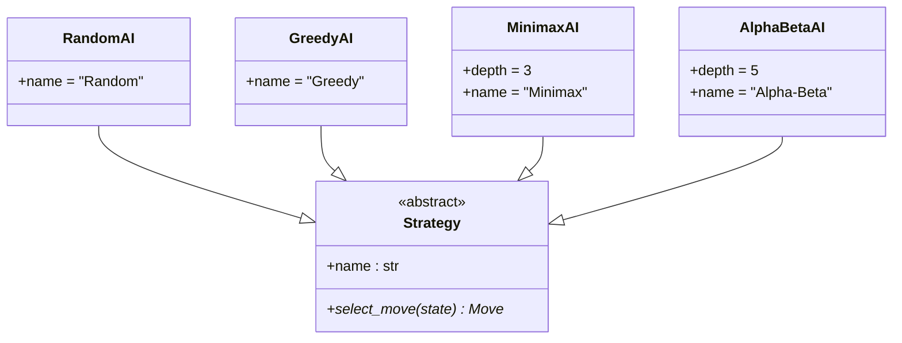
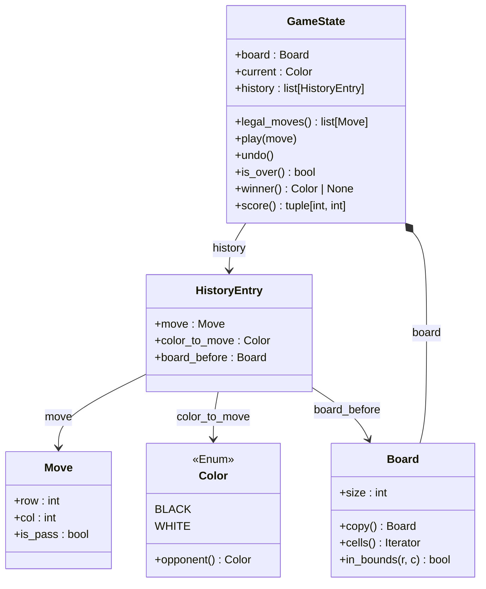
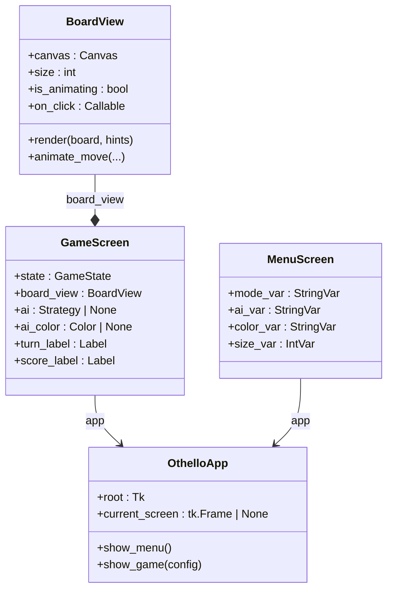
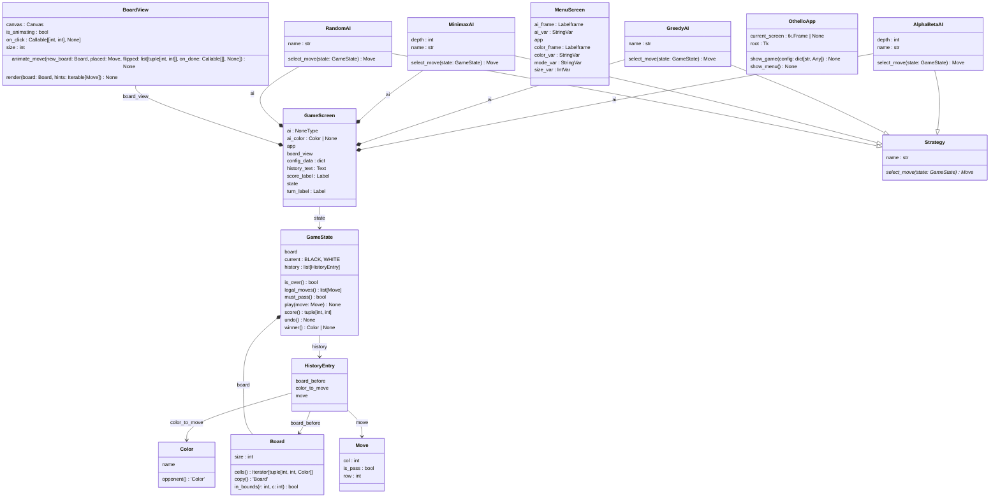
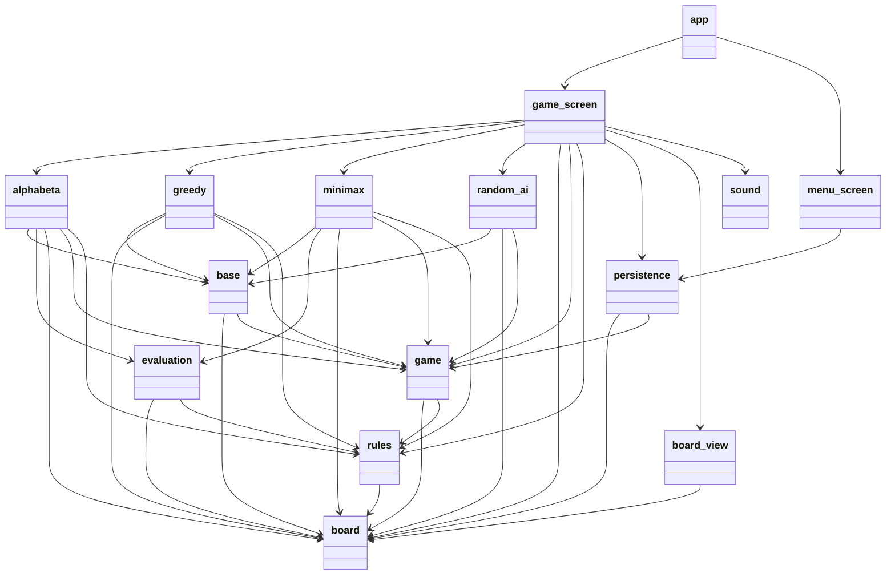

# Othello

A desktop Othello (Reversi) game in Python with Tkinter, structured as a layered learning project: pure-functional `core/` engine, polymorphic `ai/` strategies, Tkinter `ui/`.

## Features

- 2-player local play and vs four AI strategies (Random, Greedy, Minimax, Alpha-Beta).
- Variable board size (6x6, 8x8, 10x10).
- Legal-move highlights, hint, undo, move history.
- Place and flip animations.
- JSON save/load via history replay.
- Optional sound effects (graceful fallback if missing).

## Setup

```bash
python -m venv .venv
source .venv/Scripts/activate    # Git-Bash on Windows; .venv/bin/activate on macOS/Linux
pip install -r requirements.txt
```

## Run

```
python main.py
```

## Test

```
pip install pytest
pytest
```

## Architecture

The codebase is organised in three layers with one-way dependencies (`ui` → `ai` → `core`), so the engine and AI run headless without Tkinter.

### Class diagrams

Split per layer for readability. Full single-diagram source: [docs/uml/classes_Othello.mmd](docs/uml/classes_Othello.mmd) (also available as [.puml](docs/uml/classes_Othello.puml), [.svg](docs/uml/classes_Othello.svg), [.png](docs/uml/classes_Othello.png)).

#### AI Strategy hierarchy

Four AI implementations share the abstract `Strategy` interface, swappable at runtime via `GameScreen`.



#### Core domain

Pure-functional engine with no GUI dependencies. `GameState` owns a `Board` and a list of `HistoryEntry` snapshots for undo.



#### UI composition

`OthelloApp` swaps between `MenuScreen` and `GameScreen`. The latter aggregates the live `GameState`, the rendered `BoardView`, and an optional `Strategy` (only in vs-AI mode).



<details>
<summary>Show full single-diagram class diagram (wide)</summary>



</details>

### Module dependency graph

19 modules, 41 imports — no cycles. Source: [docs/uml/packages_Othello.mmd](docs/uml/packages_Othello.mmd).



### Regenerating diagrams

```bash
pip install pylint                       # provides pyreverse
# Graphviz only needed for png/svg output:
#   winget install Graphviz.Graphviz     (Windows)
pyreverse -o mmd -p Othello -d docs/uml othello
pyreverse -o puml -p Othello -d docs/uml othello
pyreverse -o png  -p Othello -d docs/uml othello   # needs Graphviz on PATH
pyreverse -o svg  -p Othello -d docs/uml othello   # needs Graphviz on PATH
```

## Layout

See [docs/superpowers/specs/2026-04-30-othello-game-design.md](docs/superpowers/specs/2026-04-30-othello-game-design.md) for the design (English) and [docs/superpowers/specs/2026-04-30-othello-game-design-ko.md](docs/superpowers/specs/2026-04-30-othello-game-design-ko.md) for Korean.

Implementation plan: [docs/superpowers/plans/2026-04-30-othello-implementation.md](docs/superpowers/plans/2026-04-30-othello-implementation.md) (Korean: [-ko.md](docs/superpowers/plans/2026-04-30-othello-implementation-ko.md)).
